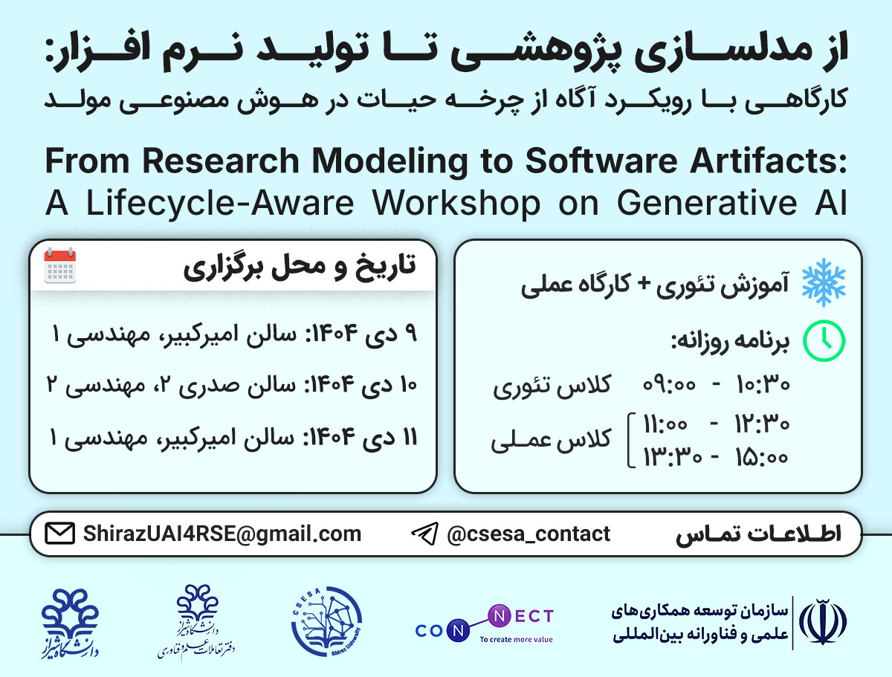

# From Research Modeling to Software Artifacts: A Lifecycle-Aware Workshop on Generative AI

**Host Institution**: Shiraz University

## Core workshop objective

To study and teach how Generative AI can support the explicit modeling of research and software lifecycles, from literature analysis and conceptual modeling to data collection and research software implementation, while maintaining traceability, quality control, and human oversight.
All hands-on artifacts and surveys are designed to be reused as empirical material for a research paper.

## Location:
- **December 30th, 2025 (9 Dey 1404):** AmirKabir Hall, Engineering Building No. 1, Shiraz
- **December 31st, 2025 (10 Dey 1404):** Sadri-II Hall, Engineering Building No. 2, Shiraz
- **January 1st, 2025 (11 Dey 1404):** AmirKabir Hall, Engineering Building No. 1, Shiraz

## Fixed daily schedule:
- 09:00-10:30 Lecture
- 10:30-11:00 Coffee and tea
- 11:00-12:30 Hands-on session I
- 12:30-13:30 Lunch
- 13:30-15:00 Hands-on session II

## Topics:

- Day 1: Research Modeling (Lifecycle)
- Day 2: Research Data Lifecycle
- Day 3: Research Software Development Lifecycle

## Hands-On Session Notes:

The hands-on sessions of this workshop will be conducted **live and in a group-based format**. The items listed below are intended to help ensure a smoother and more effective learning experience. Following these recommendations will significantly improve team collaboration and productivity during the sessions.

---

## 💻 Technical Requirements

- A laptop with **stable internet access**  
- A working **Python execution environment (Python 3.9 or higher)**  
- A simple and functional IDE such as **VS Code, PyCharm, Google Colab, GitHub Codespaces, or Jupyter Notebook**  
- Reliable internet connectivity  
- An account on a **Generative AI platform that supports file uploads**, such as:
    - ChatGPT  
    - Gemini  
    - Claude  
    - DeepSeek  
    - or similar tools  

📝 You may also use Iranian platforms such as **GapGpt.app** or **AvalAi.ir**, which provide free plans.

📝 If you have the technical background and prefer more control, you may also use **local models** (e.g., via **Ollama**) for running LLMs on your own machine.
